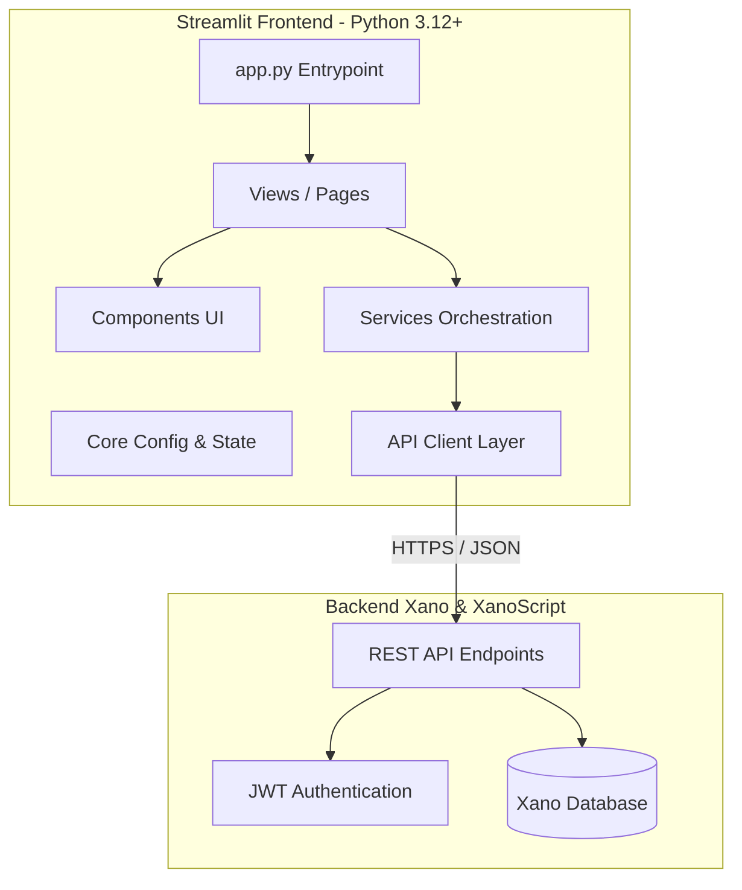

# Arquitetura do Sistema - EduTrack Orbit AI

> **Slogan:** "Organize, acompanhe e evolua"

## Visão Geral

O **EduTrack Orbit AI** é uma aplicação web educacional desenvolvida em Python 3.12+ com Streamlit, arquitetada para consumir uma API REST fornecida pelo backend Xano com lógica de servidor em XanoScript.

## Camadas da Aplicação (`app/`)

- **`core/`**: Centralização de configurações, carregamento hierárquico de variáveis (`config.py`) e gerenciamento de sessão.
- **`models/`**: Definição de schemas de dados tipados com validação Pydantic.
- **`api/`**: Clientes HTTP para comunicação com as rotas REST do Xano e injeção do token JWT.
- **`services/`**: Implementação das regras de negócio (cálculos de progresso simples e ponderado, validações).
- **`components/`**: Widgets visuais reutilizáveis (cards, métricas, alertas, modais de confirmação).
- **`views/`**: Renderização das páginas completas do Streamlit.
- **`styles/`**: Injeção de CSS personalizado, tokens de cor e suporte a temas.
- **`i18n/`**: Dicionários e lógica de tradução multi-idioma (pt-BR, en-US, en-GB, es).
- **`utils/`**: Helpers utilitários independentes de framework.
